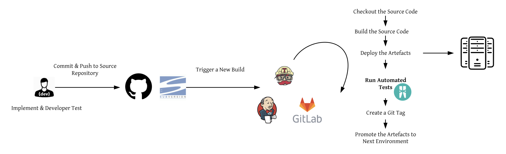
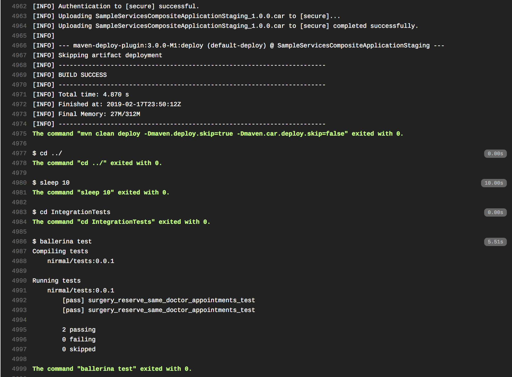

# Novel Approach To Test Your Integration Project

# Introduction

In a typical integration project, as developers you would like to continuosly enhance your integration logic with the user feedback or with your new realizations about the use cases. How can you do it confidently? .. well the answer is integration tests. You need to write your integration tests to verify and validate the logic you have implemented. Traditionally, developers used testing tools such as SOAP UI, Jmeter etc. or used programming languages such as C, Python, Java etc. SOAP UI, Jmeter are not flexible as they are graphical UI driven, hard to maintain as the output is set of scripts, not developer friendly as you need to learn specifics on using those tools (required dedicated QA teams to build those scripts). Writing integration tests using programming languages are never easy as you need to write lots of code to get a simple test done. Is there a solution? ...

[Ballerina](https://ballerina.io/) is a simple programming language whose syntax and platform address the hard problems of integration. It is a general purpose, concurrent, transactional, statically and strongly typed programming language with both textual and graphical syntaxes. Its specialization is integration - it brings fundamental concepts, ideas and tools of distributed system integration into the language and offers a type safe, concurrent environment to implement such applications. These include distributed transactions, reliable messaging, stream processing, workflows and container management platforms [1].

Ballerina has a built-in test framework named Testerina [2]. Testerina enables developers to write testable code. The test framework provides a set of building blocks to help write tests and a set of tools to help test. Developers and testers can cover multiple levels of the test pyramid including unit testing, integration testing and end to end testing with the building blocks the framework provides. It provides the flexibility to programmers and testers to build intelligent tests that suites the domain and application needs. But Testerina is to test Ballerina code, right? How can it test my integration logic? ...

I am one of the designers of Testerina and I believe we can use Testerina as a general test framework to implement integration tests for your integration projects. Testerina was designed in a way that you can leverage the full set of features of Ballerina even to write test cases. For an example, in order to provide a value set for a particular test case, you have the ability to implement another Ballerina function which returns an array of arrays. This will allow you to build your value set within the code itself by using random variables etc. instead of defining value set in a config file. Hence, I do not forsee any issue of using Testerina to test your general integration logic which is implemented using any framework or language.
This is a proof of this concept of using Ballerina's Test Framework as a general integration test framework.



# Proof Of Concept

I am using following technologies, tools, artefacts in this PoC.

- GitHub Repository
- Travis CI
- Azure Cloud Container Service
- WSO2 Enterprise Integrator 6.4.0 - Integrator Profile (https://hub.docker.com/r/wso2/wso2ei-integrator)
- WSO2 Enterprise Integrator 6.4.0 - Msf4j Profile (https://hub.docker.com/r/wso2/wso2ei-msf4j)
- Ballerina - 0.990.2 (https://ballerina.io/)
- WSO2 EI Tutorial (https://docs.wso2.com/display/EI640/Exposing+Several+Services+as+a+Single+Service#ExposingSeveralServicesasaSingleService-SendingrequeststotheESB)
   
I used Azure Cloud Container Service and spin up a new container instance for WSO2 EI - Integration profile. You have to open up 9443, 8243 and 8280 ports and expose a public IP, in order to access WSO2 EI management console and invoke services. 

Another docker container was used to deploy WSO2 EI - Msf4j profile and deployed the Hospital Service 2.0.0 jar file (https://github.com/wso2-docs/WSO2_EI/blob/master/Back-End-Service/Hospital-Service-2.0.0.jar).

Project structure of the source repository;

| File/Directory | Description |
| ------ | ------ |
|IntegrationTests|Ballerina based integration tests to test the API.|
|SampleServices|An ESB Project - which contains the API definition.|
|SampleServicesCompositeApplicationStaging|Composite application project for staging environment.|
|SampleServicesConnectorExporter|Connector project.|
|SampleServicesRegistry|Registry resources project common for all the environments.|
|SampleServicesRegistryStaging|Registry resources project for staging environment.|
|src/main/resources/security|Contains the keystore file for the WSO2 EI, in order to deploy the Application.|
|.travis.yml|Travis CI configuration file.|
|pom.xml|Maven POM file for the maven multi-module project.|

As you can see there's a registry resource project for each environment which contains the environment specific configurtion such as endpoint definitions for backend services. You would have another registry resource project for the production environment, in a real project.

In WSO2 EI, there's a concept of Composite Application and that's the deployable artefact for a WSO2 EI server. You will have another such a Composite Application project for production environment and that should follow the same naming convention i.e. `SampleServicesCompositeApplication<ENV_NAME>`

`IntegrationTests` is a Ballerina project and it has a `tests` sub folder where you place your Ballerina files which contains your integration tests.

In `.travis.yml` of this repository, you can find following section;

```yml
  ######################################################
  # Staging environment ################################
  ######################################################

  - export ENV=Staging
  # build the artefacts and deploy in staging server
  - mvn clean install -q
  - cd SampleServicesCompositeApplication$ENV
  - mvn clean deploy -Dmaven.deploy.skip=true -Dmaven.car.deploy.skip=false
  - cd ../
  - sleep 10
  # run the integration tests
  - cd IntegrationTests
  - ballerina test
```

Hope this is quite self-explanatory, where it first sets the environment name, then build the project, navigate to the composite application project, deploy the application to the staging server, wait few seconds for the application to be deployed and then run the automated tests. But where do you define the server urls? Those are defined in the `pom.xml` file of the composite application project as follows;

```xml
       <plugin>
        <groupId>org.wso2.maven</groupId>
        <artifactId>maven-car-deploy-plugin</artifactId>
        <version>1.1.1</version>
        <extensions>true</extensions>
        <configuration>
          <carbonServers>
            <CarbonServer>
              <trustStorePath>../src/main/resources/security/wso2carbon.jks</trustStorePath>
              <trustStorePassword>wso2carbon</trustStorePassword>
              <trustStoreType>JKS</trustStoreType>
              <serverUrl>${env.STAGING_EI}</serverUrl>
              <userName>admin</userName>
              <password>admin</password>
              <operation>deploy</operation>
            </CarbonServer>
          </carbonServers>
        </configuration>
      </plugin>
```

Still it has `${env.STAGING_EI}`? Yes, correct. I don't want to expose my server URL to public, so I have encrypted the server url using Travis encrypt [3] feature and the encrypted values are at the bottom of the `.travis.yml` file's `env.global` section.

# Ballerina Based Test Case

So, let's go through the [HealthCareAPITests.bal](https://github.com/nirmal070125/my_integration_project/blob/master/IntegrationTests/tests/HealthCareAPITests.bal). I have written only one test case right now, but I hope this will give you an idea on how you could leverage Testerina in your testing. Let's analyze the test code;

```ballerina
import ballerina/http;
import ballerina/test;
import ballerina/config;
import ballerina/io;
```
These are set of imports that I needed in this test case and the wonderful news is you don't need to import any libraries, write POM files etc. as all these libraries are in-built to the Ballerina language.

```ballerina
string env = config:getAsString("ENV", default = "Dev");
string eiEP = config:getAsString(env +"_EI_SERVICE", default = "http://localhost:8280");
http:Client healthAPIEP  = new(eiEP + "/healthcare");
```
Ballerina config library help you to read environment variables, config files etc. If you can recall in the `.travis.yml` file, I have set the "ENV" environment variable and here I'm retrieving that value from within my test code. 

In the test case, I need to call the API hosted in this environment and in order to do that I need the server url. Again, this is encrypted using Travis encrypt and the encrypted value is stored in the `.travis.yml` file.

Finally, we are instantiating a new HTTP client to the healthcare API using the server url.

```ballerina
int currentApptNumber = -1;

@test:BeforeEach
function beforeEachTest() { 
    currentApptNumber = -1;
}
```
`currentApptNumber` is a global variable and an integer to keep track of the ongoing appointment number. This is used within the test code. 

`@test:BeforeEach` is a annotation from the test framework and as the name implies the function will get executed before each and every test case. I am resetting the value of `currentApptNumber` in that function.

```ballerina
@test:Config {
    dataProvider: "surgery_reserve_same_doctor_appointments_data_gen"
}
function surgery_reserve_same_doctor_appointments_test(json aReq, json aRes) returns error?{
```

Then, I define my first test case. In Testerina, a test case is recognized by `@test:config` annotation. Within the annotation, I am defining a `dataProvider` which is a name of another Ballerina function that returns a json array of arrays. These 2 dimensional `json` arrays will be fed into this function recursively by the test framework. So, eventhough I have only one test case here, if I provide two json arrays, my test case will run twice against the two json arrays. This `dataProvider` feature is a elegant way to generate different combinations of data for testing purposes.

```ballerina
http:Response | error res =  healthAPIEP -> post("/categories/surgery/reserve", aReq);
```
In this line, I am doing a HTTP POST request using the input json; `aReq`. This is a network call (denoted by `->` ) and it returns a HTTP response or an error.

```ballerina
if (res is error) {
    test:assertFail(msg = "Error: "+ res.reason());
    return;
} 
```
If the returned response is an error, we should fail the test case as we couldn't proceed with assertions. Testerina provides `assertFail` operation and we can set `msg` to log the reason for failure.

```ballerina
http:Response response = res;
// assert the status code
test:assertEquals(res.statusCode, 200, msg="Unexpected status code!");
```
This is how you could assert the status code of the returned HTTP response.
Now, we can see how we can assert different attributes of the response.

```ballerina
// assert the payload
json payload = check res.getJsonPayload();
```
`check` is a special operation in Ballerina where you can lift the error. As I'm pretty sure that my service returns a JSON, I'm neglecting the error here and assigning the payload to a `json` variable. In Ballerina, `json` is a type in the language which makes you parse json objects pretty easily.

```ballerina
if (currentApptNumber == -1) {
    currentApptNumber = untaint check int.convert(payload.appointmentNo);
} else {
    // test the appointment number
    currentApptNumber = currentApptNumber + 1;
    test:assertEquals(payload.appointmentNo, currentApptNumber, 
    msg = "Appointment numbers are not generated correctly!");
}
```
`payload.appointmentNo` will give us a json which has the value of `appointmentNo` field of the `payload` json. Since, I am sure that this field is an integer, I'm converting the json object to and integer using `int.convert`. Then, I'm using `check` to lift the error and marking the value as `untaint`. This is another feature in Ballerina language where it is designed to ensure that programs written with Ballerina are inherently secure. Refer [4] for more information.

`test:assertEquals` can compare any two similar data types. In this case, I am comparing two json objects for their equality. 

```ballerina
// test the discount
float price = check float.convert(payload.actualFee);
int discount = check int.convert(payload.discount);
float actualPrice = check float.convert(payload.discounted);
test:assertEquals(actualPrice, price * (100 - discount)/100, msg ="Discount calculation wrong!");
```
Here, I am verifying whether the discounting logic is implemented correctly. I think that covers the important set of code in this test case. Refer to [2] on other features of Testerina.

# In Action

Checkout the Travis CI build for this repository at https://travis-ci.com/nirmal070125/my_integration_project/builds/101243343

Following is a screenshot of the final set of lines of the build output;



# References

[1] https://ballerina.io/learn/

[2] https://ballerina.io/learn/how-to-test-ballerina-code/

[3] https://docs.travis-ci.com/user/encryption-keys/

[4] https://ballerina.io/learn/by-example/taint-checking.html
